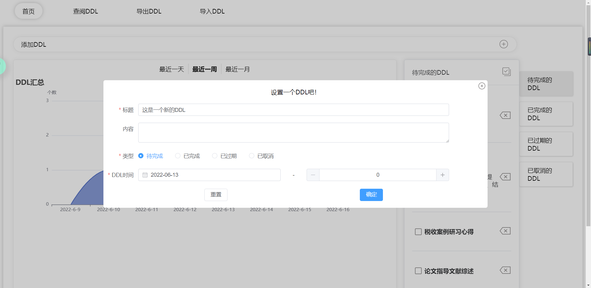

# ddlmanagement

## 项目功能
* 事件状态切换
* 筛选事件
* 添加、编辑、删除事件
* 本地化存储
* 导出/导入数据为xlsx格式

## 安装步骤
```
git clone https://github.com/xiaobaigogo/ddlmanagement.git
cd ddlmanagement
npm install
npm run serve

// 如果 node-sass 安装失败，可使用 cnpm 安装
npm install cnpm -g --registry=https://registry.npm.taobao.org
cnpm -v 			// 查看cnpm版本号确认安装成功
cnpm install node-sass -D
```

## 项目截图
### 首页


### 查阅DDL


### 导出DDL

### 导入DDL


## 特别感谢
### 主要灵感来源于 lin-xin 的 notepad项目
https://github.com/lin-xin/notepad
